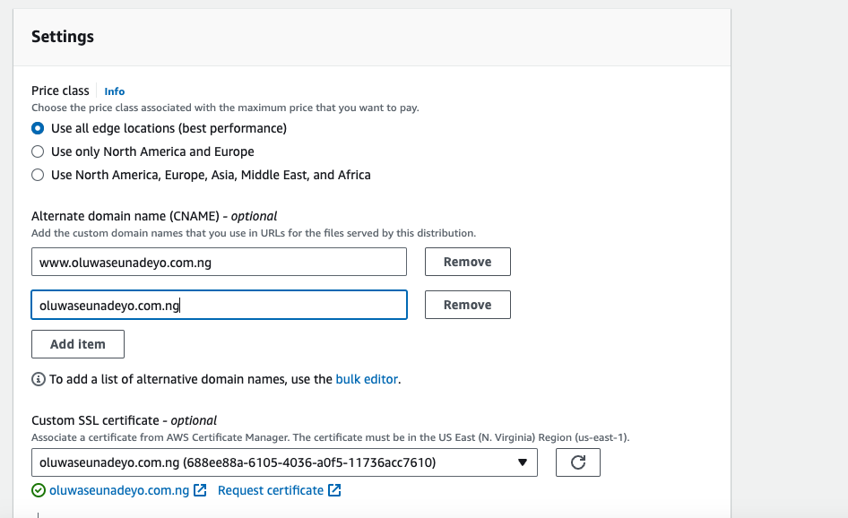

# Personal-Website
This project demonstrate how to deploy a static website to AWS using AWS S3, Cloudfront, Route53 and Github actions for the CI/CD.


<!--  -->
### Prerequisites.
* **You should have a domain name already purchased to link with your Static Website. You can use whogohost.com**
* **Your Website content to display on your domain.**
* **You have full access to Rout53, cloudfront and S3.**
  
### By the end of this post you will be able to: 
* **Create an S3 bucket and Configure it for static website hosting.**
* **Create a record in Route 53.**
* * **Create ssl certificates.**
* * **Create a cloudfront distribution.**
* **Then Finally Link the S3, Custom Domain via Route 53 and cloudfront To access your website.**
### Here is a sample of how it should look like.


## Steps 

1. Create a S3 bucket using the same name as you domain name 
    

2. Allow public access to the bucket.
    

3. Upload the files and folders from your local computer to the S3 bucket.
    

4. Change the Bucket Policy in the permissions tab to allow access to the content of the bucket.
    
```
{
    "Version": "2012-10-17",
    "Statement": [
        {
            "Sid": "PublicReadGetObject",
            "Effect": "Allow",
            "Principal": "*",
            "Action": "s3:GetObject",
            "Resource": "arn:aws:s3:::oluwaseunadeyo.com.ng/*"
        }
    ]
}
```

5. Enable Static Website hosting in the bucket properties tab.
    

6. Create a simple routing record in the same region as your s3 bucket in your already created hosted zone.
    
    Note: the hosted zone should have the same name as your domain name

7. Wait a while and you should see your website up and kicking.
   Note: this is a very simple way of hosting your website however we can take it one step further.
8. Set up CloudFront distribution. But first we need to set up certificates so we can have our website https enabled. Note you must create your ssl certificate in us-east-1. For more info on this check this [link](https://docs.aws.amazon.com/AmazonCloudFront/latest/DeveloperGuide/cnames-and-https-requirements.html)
   1. request a public certificate
        
   2. request for 2 certificate. A wildcard for subdomain name eg *www.oluwaseunadeyo.com.ng* and apex domain name **oluwaseunadeyo.com.ng**.
        Note: This might take a while.
        
   3. Create CNAME record in Route53
        
        
9.  Now lets create our cloudfront distribution
    1. Add the Origin domain name
        
    2. Redirect form HTTP to HTTPS
        
    3. Enable secuirty protection
        
    4. Add your apex and wildcard domain name. Then select your custom ssl certificate
        
    5. Add your landing/home page(index.html).
        
        Now we should have something.cloudfront.net serving our website. But thats not what we want to be calling to get to the website. So we need to change the DNS settings 

10. Create an A record to point to the cloudfront distribution. 
    
    We are going to modify the previous record to point to out cloudfront distribution rather than our s3 endpoint url link
    
    You can also create another A record but this time with a www subdomain.
